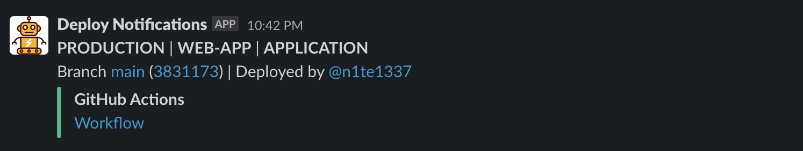

# Slack Deployment Action

A simple GitHub Action that posts the workflow deployment notification to a Slack channel.

## Features

- Posts workflow status (success, failure, cancelled) to a Slack channel.
- Includes environment, repository, and deployment type information in the message.
- Provides links to branch, commit, and GitHub Actions workflow.

## Usage

To use this action, add the following step in your GitHub Actions workflow file:

```yaml
- name: Post workflow status to Slack
  uses: fleetactions/actions-slack-deployment@v1
  with:
    workflow-status: ${{ job.status }}
    environment-name: staging
    deployment-type: application
    slack-webhook-url: ${{ secrets.SLACK_WEBHOOK_URL }}
```
### Inputs

| Name                | Description                                                                              | Required |
|-------------------- |------------------------------------------------------------------------------------------|----------|
| `workflow-status`   | The status of the job (`success`, `failure`, `cancelled`)                                | Yes      |
| `environment-name`  | Environment name for the deployment (e.g., `staging`, `uat`, `production`)               | Yes      |
| `deployment-type`   | Deployment type (e.g., `application`, `infrastructure`)                                  | No       |
| `slack-webhook-url` | [Slack webhook URL](https://api.slack.com/messaging/webhooks) for publishing the message | Yes      |

## Example Slack Message



## Contributing
If you want to contribute, you are welcome to submit a pull request. Please make sure that your changes are tested and documented.

## License
This project is licensed under the MIT License - see the [LICENSE](LICENSE) file for details.
